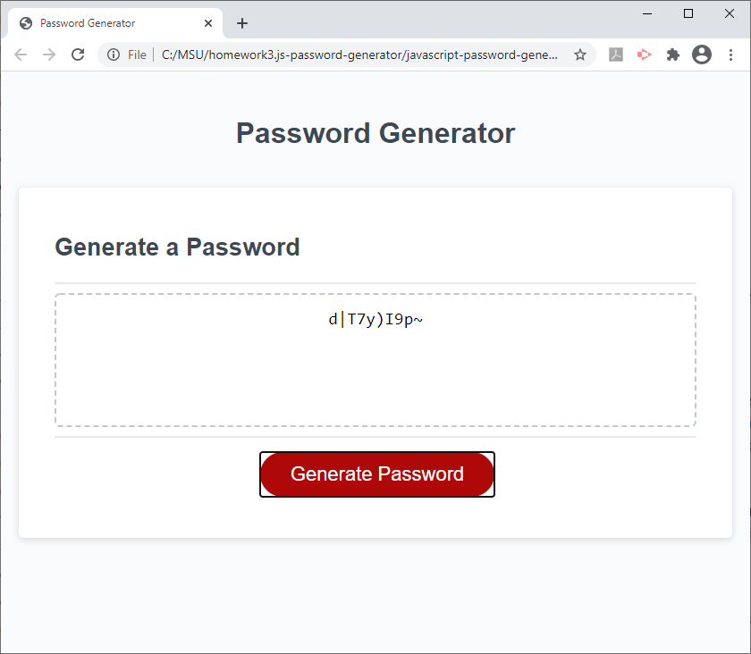

# JavaScript Password Generator

Password generator website

# Technologies Used
JavaScript 64.7%   CSS 24.1%   HTML 11.2%

# Mock-up

# Link to live site
[Password Generator](https://jodybrzo.github.io/javascript-password-generator/index.html)

## Why I made this site
I created this password generator to display my JavaScript skills.  This website, when the user clicks the "Generate Password" button will display a series of prompts to the user.  The user can select the length of the password between 8 and 128 characters and can choose characters of uppercase, lowercase, numbers or symbols.

## What I learned
I learned many important fundementals of javascript creating this project.  I used a combination of objects, arrays, function calls, while statements and if statements.  I learned how to call functions, return values and many different manipulations that can be performed on objects, arrays and numbers like Math.Floor, Math.random and isFinite.  I also learned commonly used operators like ! and ===. I really enjoyed my time learning and creating this project!

## Challenges 
There were a few challenges I ran into making this password generator.  I had a hard time trying to figure out how to ensure the user input a password length between 8 and 128 characters as well as ensuring the user entered an integer.  By searching documentation and not giving up I was able to use if/else statements and isFinite and was able to overcome those challenges.

## License
All code on this site is copyrighted Jody Brzovski - 2020 
